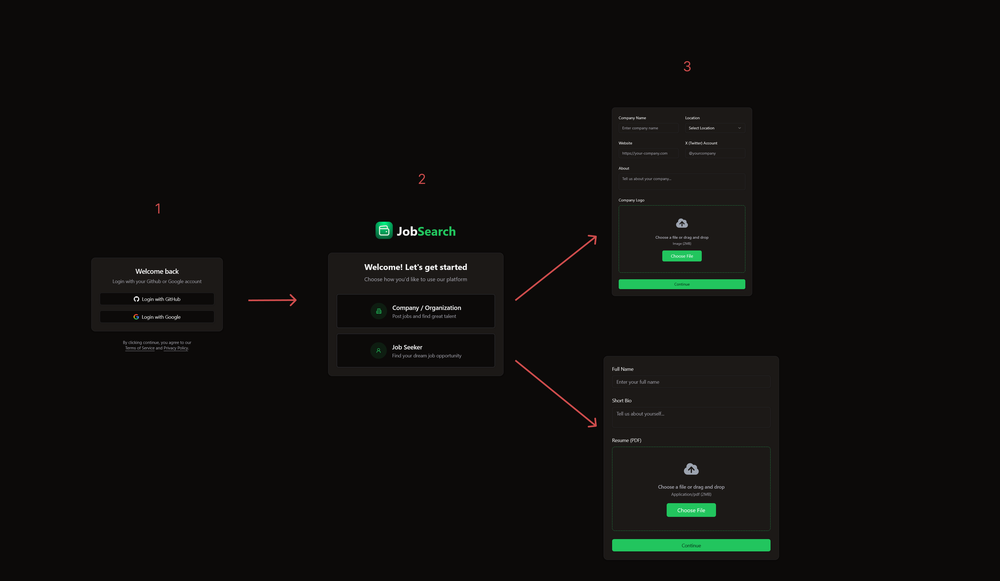

# Job Board 

<!--  -->
A powerful platform connecting job seekers and employers with ease. Built with Next.js and TypeScript, Job Board offers a seamless, secure, and feature-rich experience for exploring jobs, creating listings, and managing profiles—all hosted on Vercel. Whether you're posting a job or searching for your next career move, we've got you covered.

[https://job-search-roan.vercel.app](https://job-search-roan.vercel.app/)

## Table of Contents
- [Features](#features)
- [Tech Stack](#tech-stack)
- [Screenshots](#screenshots)
- [Get Started](#get-started)

<!-- 
- [Installation](#installation)
- [Configuration](#configuration)
- [Contributing](#contributing)
- [License](#license) -->

## Features

### **📝 Onboarding** in three stages: 
Login ->  Choose you role -> Setup your profile!

### For Company
- **🛡️ Profile Setup**: Add company details and upload a logo for branding.
- **📝 Job Post Creation**:  
  - Craft stunning job listings with a rich text editor powered by Tiptap.  
  - Set custom salary ranges with an intuitive slider.  
  - Smooth image uploading with UploadThing.  
  - Choose listing durations: 30, 60, or 90 days.  
- **💳 Stripe Payment Integration**: Securely process payments for job postings with webhooks for activation and expiration.

### For Job Seekers
- **Profile Management**: Provide your details and upload your CV in PDF format to stand out.  
- **📄 Index Page**: Browse all job posts with filtering, pagination, and suspense for fast loading.  
- **⭐ Favorites Route**: Save your top picks to revisit later.  
- **🆔 Job Post Details**: View detailed job info and Apply or Save to favourites.

### Smart Automation
- **📬 Inngest Background Workflow**: Listings automatically expire after their set duration—no manual updates needed.

### Security & Performance
- **🛡️ Arcjet Security**: Protection against XSS, SQL injection, and other attacks with custom rate limiting (higher limits for authenticated users, bot protection).  
- **🚀 Vercel Deployment**: Fast, reliable performance on Vercel.

### More Power for Users
- **🗂️ CRUD Functionality**: View, edit, or delete your job posts effortlessly.  

### Best UI practices
- **Skeleton**: Pretty placeholders for loading content!
 

## Tech Stack

Our platform is powered by cutting-edge technology:  
- **[Next.js 15.1.7](https://nextjs.org/)**: Fast, modern web framework.  
- **[TypeScript 5](https://www.typescriptlang.org/)**: Type-safe coding.  
- **[Prisma 6.3.1](https://www.prisma.io/)**: Database management.  
- **[Shadcn](https://ui.shadcn.com/) & [Tailwind CSS](https://tailwindcss.com/)**: Beautiful, accessible design.  
- **[NextAuth.js](https://next-auth.js.org/)**: Secure authentication.  
- **[Arcjet](https://arcjet.com/)**: Top-notch security, rate-limiting.  
- **[Inngest](https://inngest.com/)**: Automated workflows.  
- **[Stripe](https://stripe.com/)**: Reliable payments.  
- **[Tiptap](https://tiptap.dev/)**: Rich text editing for job posts.  
- **[UploadThing](https://uploadthing.com/)**: Smooth file uploads.  

## Screenshots

### Sections

Desktop <b>CLICK</b> to see

#### Homepage

#### Homepage Empty List

#### Post Job

#### Job Info

#### My Job Listings

#### My Saved Jobs

#### My Saved Jobs Empty List

### Forms

Forms <b>CLICK</b> to see

#### Company

#### Jobseeker

#### Post Job

#### Edit Job

### Modals and other components

Modals <b>CLICK</b> to see

#### Login

#### Choose User Type

#### Search Filter

#### User Toggle

### Pagination

#### Themes
 

#### Payment Success

#### Payment Cancel

### Skeletons 

Skeletons <b>CLICK</b> to see

#### Home Skeleton

#### My Job Listings Skeleton

#### Saved Jobs Skeleton

### Mobile

Mobile <b>CLICK</b> to see

- Homepage <b>CLICK</b>

- My Job Listing <b>CLICK</b>

- Saved Jobs <b>CLICK</b>

- Job Card <b>CLICK</b>

- Create Job

## Get Started

Ready to find your next job or hire top talent?  

Visit us at [https://job-search-roan.vercel.app/](https://job-search-roan.vercel.app/) and join the community!

- Sign Up/Log In: Create an account as an Company or Job Seeker.  
  - **Company**: Create your first job post and reach thousands.  
  - **Job Seekers**: Sign up and upload your CV today. 
- Set Up Profile: Add logos (companys) or CVs (seekers).  
- Post or Browse: Create listings or explore jobs with filters and favorites.  
- Pay & Publish: Use Stripe to activate job posts.  
- Stay Updated: Receive job summaries via email.